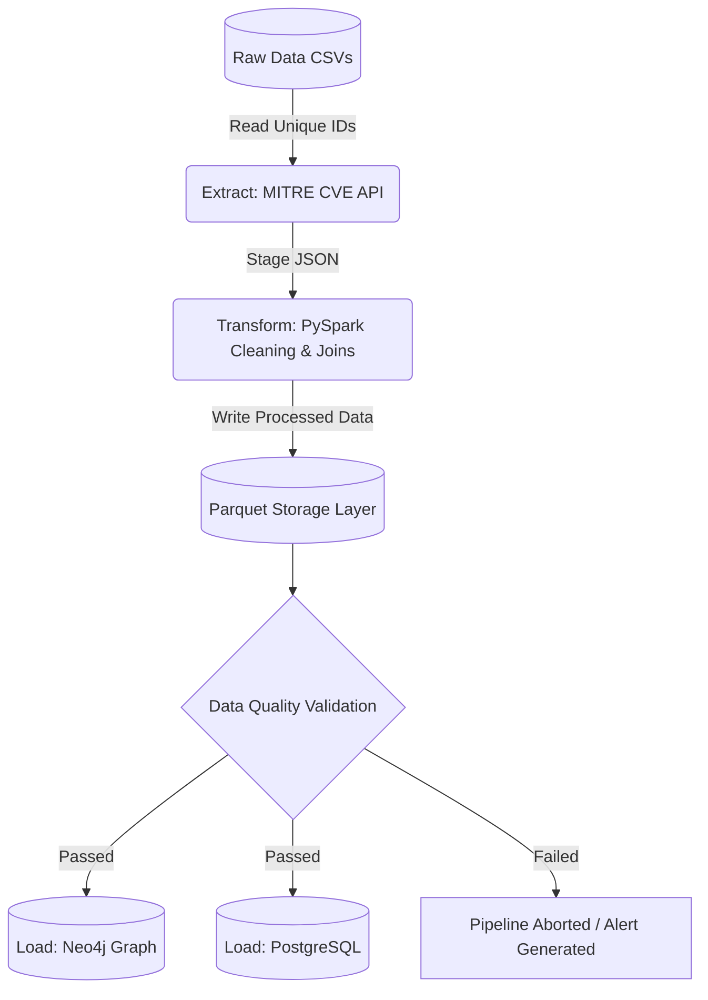

# Vulnerability and Exposure Management Pipeline

## Overview
This project implements a robust, idempotent ELT (Extract, Load, Transform) pipeline designed for a Vulnerability and Exposure Management Platform. 

The pipeline ingests daily device and scan data, enriches it with real-time vulnerability details from the MITRE CVE API, cleans and transforms the data using PySpark, and strictly validates data quality before loading it into a Neo4j graph database (for attack surface analysis) and a PostgreSQL database (for statistical reporting).

## System Architecture & Workflow

The pipeline strictly adheres to a **Linear "Transform-Validate-Load"** architecture. To ensure data integrity, the Data Quality (DQ) checks act as a strict gatekeeper. Downstream database loads will automatically halt if critical data quality anomalies are detected in the staging files.



## Tech Stack
* **Language:** Python 3.14
* **Orchestration:** Apache Airflow 2.x
* **Data Processing:** PySpark & Pandas (with PyArrow)
* **Databases:** Neo4j (Graph), PostgreSQL (Relational)
* **Environment Management:** `dotenv`

## Setup & Installation

### 1. Clone & Environment Setup
Create a virtual environment and install the dependencies:
```bash
python -m venv .venv
source .venv/bin/activate
pip install -r requirements.txt
```

### 2. Configuration (.env)
Copy the template environment file to configure your local credentials safely:
```bash
cp .env.example .env
```
(Ensure your .env contains the required database passwords and AIRFLOW_HOME variables).

### 3. Spin up Infrastructure
Start the required databases locally using Docker:
```bash
# Start Neo4j
docker run -d \
  --name neo4j \
  -p 7474:7474 -p 7687:7687 \
  -e NEO4J_AUTH=neo4j/password123 \
  neo4j:latest

# Start PostgreSQL
docker run -d \
  --name postgres_db \
  -p 5432:5432 \
  -e POSTGRES_USER=postgres \
  -e POSTGRES_PASSWORD=postgres \
  -e POSTGRES_DB=vulnerability_db \
  postgres:15
```

### 4. Execute the Pipeline
Trigger the pipeline tasks locally in sequential order to simulate a daily run:

```bash
airflow tasks test vulnerability_pipeline extract_cve_api 2026-03-20
airflow tasks test vulnerability_pipeline pyspark_transformations 2026-03-20
airflow tasks test vulnerability_pipeline data_quality_checks 2026-03-20
airflow tasks test vulnerability_pipeline load_neo4j 2026-03-20
airflow tasks test vulnerability_pipeline load_postgres 2026-03-20
```

## Data Quality Framework
The pipeline implements an automated DQ framework to catch realistic data anomalies before ingestion.

| Check Type | Description | Action on Failure |
| :--- | :--- | :--- |
| **Schema Validation** | Ensures all required columns are present. | Pipeline Halts |
| **Completeness** | Requires 95%+ coverage on critical IDs. | Pipeline Halts |
| **Uniqueness** | Prevents duplicate master device records. | Pipeline Halts |
| **Range Checks** | Validates CVSS scores (0-10) and severities. | Logs Warning |
| **Integrity** | Detects orphaned scans missing master data. | Logs Warning |

## Graph Analytics (Neo4j)
Once loaded, the graph database enables complex attack surface queries. Here are example Cypher queries used to extract insights:

### 1. Find the Most Vulnerable Divisions (Blast Radius):
```Cypher
MATCH (div:Division)<-[:BELONGS_TO]-(d:Device)-[:HAS_VULNERABILITY]->(v:Vulnerability)-[:IS_CVE]->(c:CVE)
WHERE c.severity IN ['High', 'Critical']
RETURN div.name AS Division, count(d) AS HighlyVulnerableDevices
ORDER BY HighlyVulnerableDevices DESC;
```

### 2. Identify the Top 5 Most Prevalent Vulnerabilities:
```Cypher
MATCH (d:Device)-[:HAS_VULNERABILITY]->(v:Vulnerability)-[:IS_CVE]->(c:CVE)
RETURN c.cve_id AS CVE, c.severity AS Severity, count(d) AS AffectedDevices
ORDER BY AffectedDevices DESC
LIMIT 5;
```

## Project Structure
```plaintext
vulnerability-pipeline/
│
├── dags/                          # Airflow DAG definitions
│   └── vulnerability_dag.py       # Main pipeline orchestration
│
├── src/                           # Business logic modules
│   ├── config/                    
│   │   └── settings.py            # Environment & variable loading
│   ├── ingestion/                 
│   │   ├── csv_reader.py          
│   │   └── cve_api.py             # MITRE API client with rate-limiting
│   ├── staging/                   
│   │   └── writer.py              
│   ├── transformations/           
│   │   └── spark_jobs.py          # PySpark cleaning and enrichment
│   ├── loaders/                   
│   │   ├── neo4j_loader.py        # Graph constraints and UNWIND merges
│   │   └── postgres_loader.py     
│   ├── quality/                   
│   │   └── checks.py              # DQ validation logic (Stopper)
│   └── utils/                     
│
├── data/
│   ├── raw/                       # Initial CSV inputs
│   ├── staging/                   # Intermediate JSON API outputs
│   └── processed/                 # Cleaned Parquet files
│
├── tests/                         # Unit and integration tests
│
├── requirements.txt               # Pipeline dependencies
├── .env.example                   # Environment variable template
├── README.md                      
└── .gitignore
```